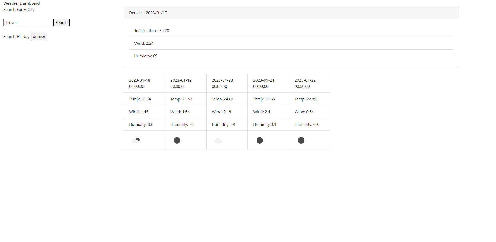
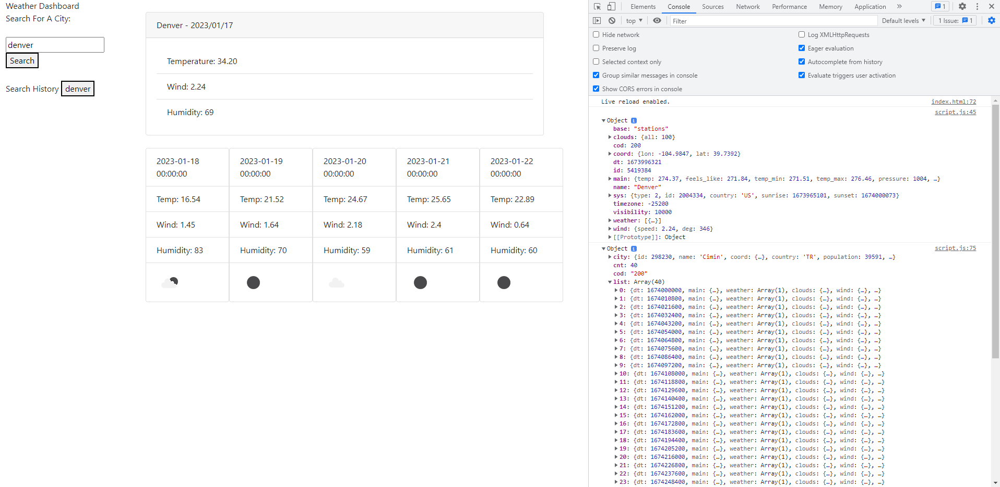
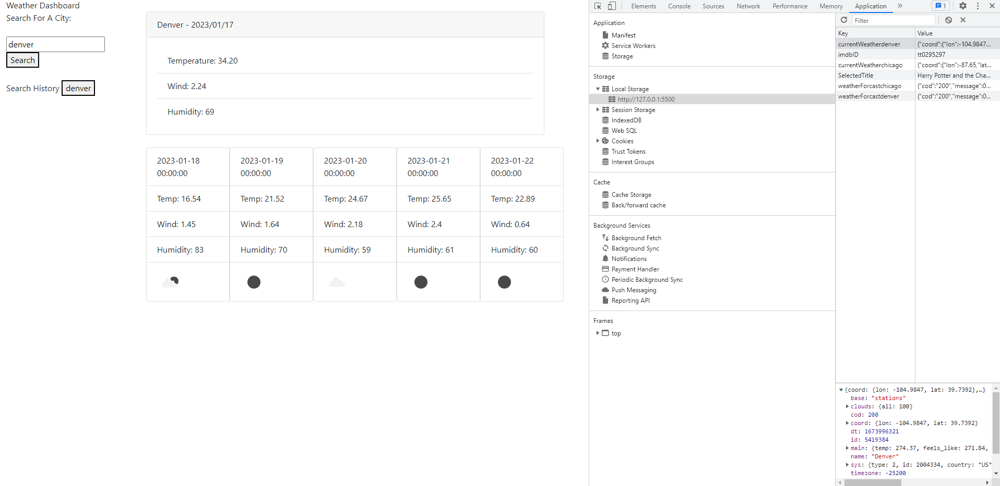
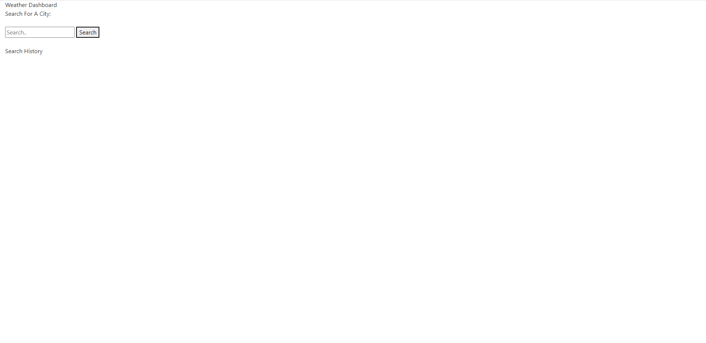

# Weather Application

## Description
A weather application that takes the name of a city and then displays the current weather and the five day forcast expectations. The data is then stored in a history so that it can be used in the future.

caption: populated field after first search
 

 
caption: objects retrieved from api call
 

 
caption: both objects saved to localStorage for future use
 

 
caption: Prompt when page first opens
 

## Installation
N/A
## Usage
Go to the following URL:

## Credits
Karen Peazzoni: https://github.com/kpeazzoni/UTA-JS-Challenge-3
## License
Please refer to the LICENSE in the repo.

